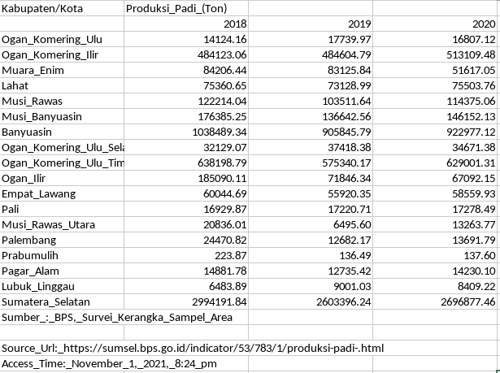
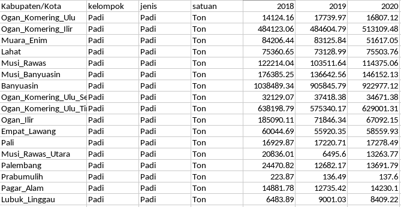

# Deskripsi

Program ini berfungsi untuk mengesktrak data-data esensial dari data BPS
sehingga memudahkan pengguna dalam menyiapkan data sebelum melakukan analisis.
Python digunakan pada proyek ini karena memiliki librari atau modul yang mencukupi untuk kebutuhan ekstraksi seperti **pandas**.
    
# Data BPS

Secara umum data yang tersedia di BPS memiliki format excel (**xlsx**). Data yang akan diolah pada program ini merupakan data produksi komoditia suatu wilayah yang memiliki variasi terhadap golongan atau kelompok, jenis dan tahun. Sebagai contoh, data yang digunakan merupakan beberapa data komoditi di Sumatera Selatan.

Data BPS memiliki format khusus seperti tabel pivot yang merangkum data dalam beberapa tahun.



Program ini dapat mengeksrak data esensial dan merubahnya ke dalam format yang lebih mudah untuk dianalisis.



# Pemakaian

Program ini dirancang sebagai fungsi yang menerima input berupa **DataFrame**. Salah satu bentuk penggunaannya adalah dengan memasukkan fungsi tersebut kedalam metode `.pipe()` pada pandas.

```
filename = 'tes/Produksi Tanaman Sayuran.xlsx'
df = pd.read_excel(filename)
df = df.pipe(bps_parse)
```
