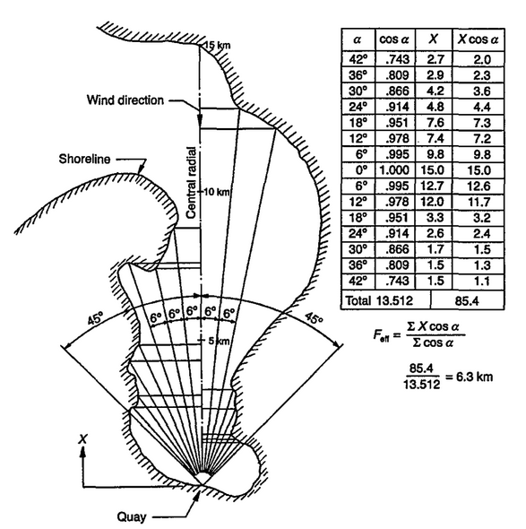
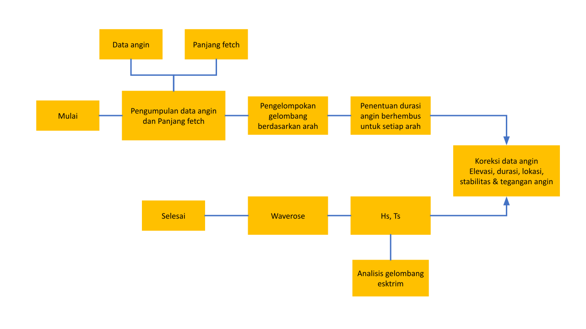
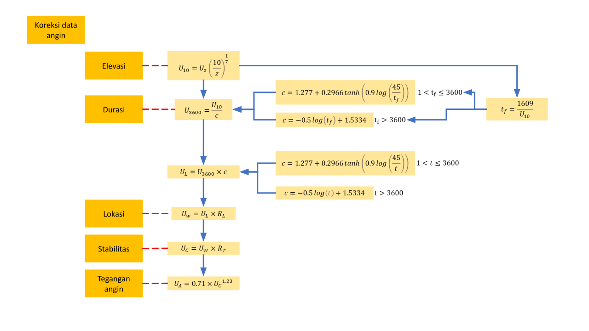
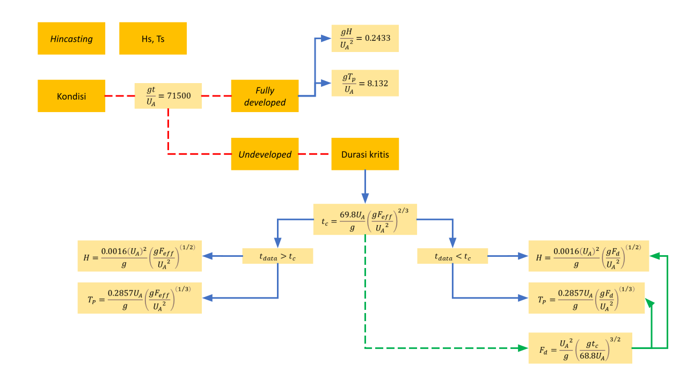
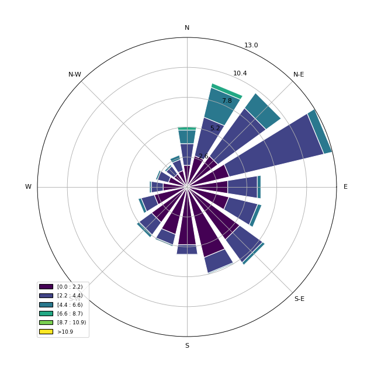

# Analisis Hindcasting

Analisis ini bertujuan untuk memprediksi tinggi dan perioda gelombang signifikan di suatu peraian menggunakan data kecepatan angin. Standar yang digunakan pada analisi ini mengacu pada SPM 1984 (*Shore Protection Manual*).

## Modul

Terdapat beberapa modul atau librari yang digunakan untuk keperluan analisis, diataranya:

- Pandas untuk pengolahan data
- Matplotlib dan Windrose untuk visualisasi data

## Data

Secara umum data yang digunakan pada analisis ini ada 2 yaitu data angin dan panjang fetch efektif di perairan.

### Data angin

Pada data angin ada 2 informasi penting yang diperlukan yaitu waktu, kecepatan dan arah angin. Contoh data tersebut dapat dilihat pada folder `data_angin` yang berisi data untuk beberapa tahun.

### Panjang fetch efektif

Data ini merupakan jarak terjauh dari titik tinjau terhadap darata terdekat untuk setiap arah.

Panjang fetch efektif data dicari dengan persamaan berikut

$$ F_{eff} = \frac{\sum X \cos \alpha}{\sum \cos \alpha} $$

yang bersumber dari (Thoresen, 2003).

## Analisis

Terdapat beberapa tahapan dalam analisis ini

### Ekstraks data

Karena data angin berada dalam file yang terpisah, perlu dilakukan penyatuan dan pengampilan *field* atau kolom pada tabel yang dibutuhkan saja seperti waktu, kecepatan dan arah angin. Langkah ini dapat dilihat pada [tautan ini](./ekstrak_data.py). Hasil penggabungan disimpan kedalam file `dataset.csv`.

### Hindcasting

Langkah ini terdapat pada [file](./hindcasting.py)

### Penentuan gelombang maksimum

Langkah ini dapat dilihat pada [file](./gelombang_maks.py).

### Visualisasi *Windrose*

Visualisasi tersebut dapat dibuat dengan menggunakan data kecepatan dan arah angin. Langkah tersebut dapat dilihat pada [file](./visualisasi_windrose.py)

