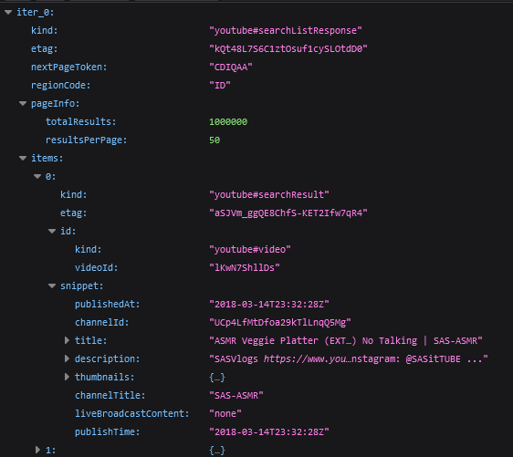
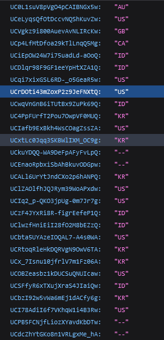
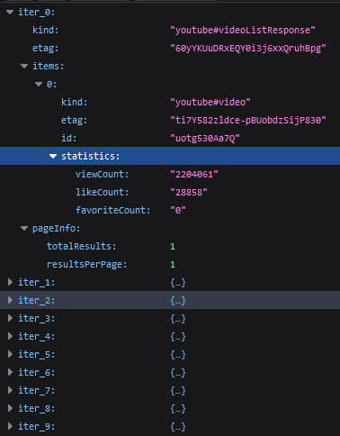
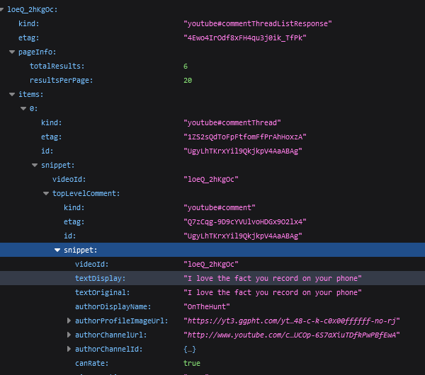

# Ekstrak Data Video Menggunakan Python dan YouTube API

## Deskripsi *Project*

Bertujuan untuk mengekstrak data video youtube seperti:

- Judul video
- Deskripsi video
- Tautan video
- Kode negara kanal tsb. mengupload video
- Tanggal upload
- Jumlah *like*
- Jumlah *view*
- Beberapa komentar teratas, jika tersedia

Output yang didapatkan adalah file excel atau csv berisi beberapa data berdasarkan *keywords* yang digunakan.

## Persyaratan

Selain Python, YouTube API dapat digunakan pada bahasa pemrograman lainnya seperti JavaScript, PHP dan Ruby. Berdasarkan laman [*Guides*](https://developers.google.com/youtube/v3/quickstart/python) terdapat beberapa persyaratan yang perlu dipenuhi sebelum menggunakan YouTube API:

1. Memiliki kunci API (API *keys*) yang dapat diperoleh dari *Google Developer Console*
2. Python dengan versi `2.7` atau di atas `3.5+`
3. Paket manager Python `pip`
4. Librari *Google APIs Client* untuk python:

    ```{bash}
    pip install --upgrade google-api-python-client
    ```
5. Librari tambahan untuk otorisasi pengguna:

    ```{bash}
    pip install --upgrade google-auth-oauthlib google-auth-httplib2
    ```

## Struktur *Project*

*Project* ini terdiri dari 2 folder berupa `data` berisi informasi yang didapatkan dan hasil akhir serta `ytscrapper` berisi kumpulan fungsi yang dibutuhkan. Untuk mendapatkan hasil yang diinginkan, *project* dibagi menjadi beberapa tahapan (berkas program) dengan fungsi masing-masing mulai dari mencari dan mendapatkan informasi awal dari keywords yang diberikan, mengkompilasi hasil pencarian, mendapatkan informasi statistik video (*like* dan *view*).

| Berkas                       | Fungsi                                       |
| ---------------------------- | -------------------------------------------- |
| `search_videos.py`           | Mencari daftar video                         |
| `resume_search_result.py`    | Mengkompilasi hasil pencarian                |
| `video_statistic_comment.py` | Mendapatkan informasi statistik dan komentar |
| `compile_results.py`         | Mengkompilasi dan menyimpan luaran           |


Struktur folder dan berkas pada project sesuai dengan skema berikut:

```
youtube-scraping/
├── data/
│   ├── json_search/
│   │   ├── comments.json
│   │   ├── countries.json
│   │   ├── likeCounts.json
│   │   └── search.json
│   └── results/
│       ├── results.csv
│       └── resume_research.csv
├── ytscrapper/
│   ├── __pychace__
│   ├── __init__.py
│   └── ytmethod.py
├── compile_results.py
├── README.md
├── resume_search_result.py
├── search_videos.py
└── video_statistic_comment.py
```

## Tahapan Ekstraksi

## Fungsi yang dibutuhkan

File `ytmethod.py` pada folder `ytscrapper` berisi fungsi esensial yang dibuthkan di antaranya:

1. `get_videos(keys, pageToken, numResults=50)`

    Bertujuan untuk mendapatkan daftar video yang dicari berdasarkan *keywords* `keys` berupa 1 atau lebih kata yang dipisahkan oleh koma `,` (contoh `'mukbang, nutrition, ASMR'`). `pageToken` merupakan parameter berisi informasi token halaman atau id halaman, bagian ini dapat berisi string kosong (`''`) serangkain string (`'CKYEEAE'`). Secara *default* total hasil pencarian adalah 50 (merupakan angka maksimal).

2. `get_video_country(channelID)`

    Bertujuan untuk mendapatkan kode negara dari kanal yang mengupload video terkait. Hasil berupa kode 2 huruf seperti `ID` untuk Indonesia, `JP` untuk Jepang dan `CA` untuk Kanada. Parameter yang diperlukan adalah id kanal `channelID`, dapat ditemukan pada hasil fungsi sebelumnya.

3. `get_like_counts(videoID)`

    Bertujuan untuk mendapatkan informasi statistik video berupa jumlah *like* dan *view*. Parameter yang dibutuhkan adalah id video `videoID`, dapat ditemukan pada hasil fungsi pertama.

4. `get_comments(videoID)`

    Bertujuan untuk mendapatkan beberapa komentar dari video jika tersedia. Parameter yang diperlukan sama seperti fungsi sebelumnya.

### Memasukkan API *key*

Ganti kunci API yang diperlukan pada bagin [ini](ytscrapper/ytmethod.py).

### Mencari daftar video

Hasil pencarian daftar video menggunakan fungsi `get_videos(keys, pageToken, numResults=50)` mendapatkan informasi untuk 1 halaman saja. Untuk mendapatkan lebih dari 1 halaman perlu mengganti nilai pada variabel `tokePage` menjadi `nextTokenPage` dari data yang diperoleh pada halaman pertama. Proses iterasi tersebut terus berlanjut hingga mencapai jumlah data yang diinginkan atau sampai halaman terakhir. Hasil pencarian tersimpan dalam file json seperti di bawah ini:



Hasil pencarian disimpan pada lokasi `data/json_search`

### Mengkompilasi hasil pencarian

Kompilasi beberapa data dari hasil pencarian disimpan dalam bentuk csv memuat informasi berikut:

- Id video (`videoId`)
- Id kanal (`channelId`)
- Judul Video (`title`)
- *Link* Video (`url`)
- Deskripsi Video (`description`)
- Waktu upload (`publishedAt`)
- Token halaman selanjutnya (`nextTokenPage`)

### Mendapatkan informasi kode negara



### Mendapatkan informasi statistik dan komentar

Informasi statistik video yang dapat diambil adalah jumlah *like* dan *view*.



Informasi beberapa komentar berada pada *key* `topLevelComment.snippet.textDisplay`. Hasil komentar disimpan dalam bentuk daftar komentar. Bagi video yang komentarnya dimatikan atau tidak memiliki komentar akan dinilai sebagai `Comment Disabled` dan `There is no comment`.



### Mengkompilasi dan menyimpan luaran

Hasil akhir berupa file excel atau csv seperti di bawah ini:

| videoId     | channelId                | title                                                                                                        | description                                                                                                                                | publishAt            | videoUrl                                    | countries | likeCount | topLevelComment                                                                                                                                                                                                                                                                                                                                                                                           |
| ----------- | ------------------------ | ------------------------------------------------------------------------------------------------------------ | ------------------------------------------------------------------------------------------------------------------------------------------ | -------------------- | ------------------------------------------- | --------- | --------- | --------------------------------------------------------------------------------------------------------------------------------------------------------------------------------------------------------------------------------------------------------------------------------------------------------------------------------------------------------------------------------------------------------- |
| uotg530Aa7Q | UC0L1suV8pVgO4pCAIBNGx5w | Obsession with Instagram &#39;clean eating&#39; trend turns into eating disorder &#124; 60 Minutes Australia | A different form of eating disorder - Orthorexia nervosa - is on the rise due to the impact of social media. It involves a fixation on ... | 2018-10-29T09:00:07Z | https://www.youtube.com/watch?v=uotg530Aa7Q | AU        | 28858     | ['There is no comments']                                                                                                                                                                                                                                                                                                                                                                                  |
| uotg530Aa7Q | UC0L1suV8pVgO4pCAIBNGx5w | Obsession with Instagram &#39;clean eating&#39; trend turns into eating disorder &#124; 60 Minutes Australia | A different form of eating disorder - Orthorexia nervosa - is on the rise due to the impact of social media. It involves a fixation on ... | 2018-10-29T09:00:07Z | https://www.youtube.com/watch?v=uotg530Aa7Q | AU        | 28858     | ['There is no comments']                                                                                                                                                                                                                                                                                                                                                                                  |
| loeQ_2hKgOc | UCeLyqsQfOtDccvNQShKuvZw | Intermittent Fasting VLOG Daily Results 7/7/2021 Before and After                                            | INTERMITTENT FASTING My intermittent fasting schedule sometimes change if I have an event coming up or have a dinner ...                   | 2021-07-07T23:17:52Z | https://www.youtube.com/watch?v=loeQ_2hKgOc | US        | 17        | ['I love the fact you record on your phone', 'Wow great results Aida. So much respect for you. Working , vlogging, meal prepping, walking , and exercising. A lot on your plate but you’re doing it , girl you’re bad ass 💪', 'Ooops forgot to ask you.  Do you think the time change has anything to do with you losing so fast.  I know you said you were having your last meal at 3 now instead of 4'] |
| loeQ_2hKgOc | UCeLyqsQfOtDccvNQShKuvZw | Intermittent Fasting VLOG Daily Results 7/7/2021 Before and After                                            | INTERMITTENT FASTING My intermittent fasting schedule sometimes change if I have an event coming up or have a dinner ...                   | 2021-07-07T23:17:52Z | https://www.youtube.com/watch?v=loeQ_2hKgOc | US        | 17        | ['I love the fact you record on your phone', 'Wow great results Aida. So much respect for you. Working , vlogging, meal prepping, walking , and exercising. A lot on your plate but you’re doing it , girl you’re bad ass 💪', 'Ooops forgot to ask you.  Do you think the time change has anything to do with you losing so fast.  I know you said you were having your last meal at 3 now instead of 4'] |

